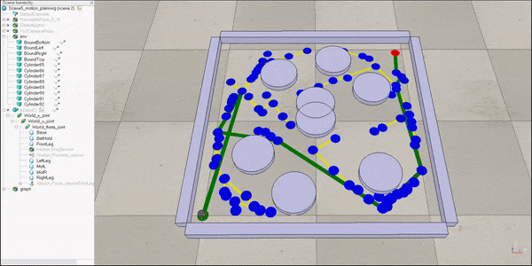

# <a href="https://www.coursera.org/specializations/modernrobotics">Modern Robotics: Mechanics, Planning, and Control Coursera</a>
## Repository with solution programming assignments

##
- [x] Course I
- [x] Course II
- [x] Course III
- [x] Course IV
- [ ] Course V
- [ ] ~~Course VI~~ (didn't take)

##
## For C++ need - <a href="http://eigen.tuxfamily.org/index.php?title=Main_Page">Eigen library</a>

## path planning RRT:

## Robot arm dynamic:

